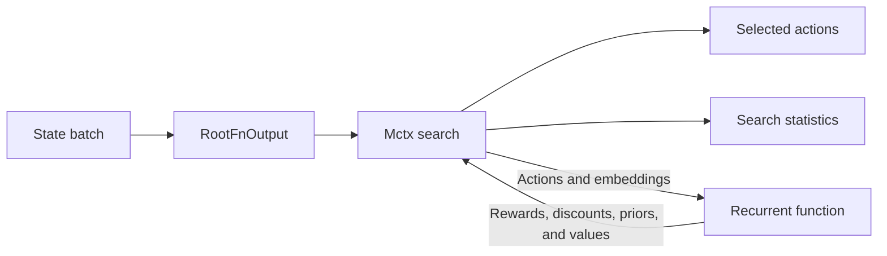

TL;DR: This tutorial turns a familiar tic-tac-toe game into the batched model
interface expected by Mctx. We use the same code on an NVIDIA GPU or a CPU
fallback, solve tactical positions, play complete games, and measure how
batching changes search throughput.

<!-- more -->

## What You'll Build

By the end of this tutorial you will have:

- A JAX-native model of tic-tac-toe transitions, wins, draws, and legal moves
- A batched `mctx.RootFnOutput` and recurrent model
- A deterministic Mctx player that plugs into the project's existing game loop
- Outcome comparisons of Mctx and rollout MCTS against the same random opponent
- A synchronized benchmark that separates JIT compilation from search time
- One Docker image that uses an NVIDIA GPU when available and falls back to CPU

The implementation and executable notebook live in the
[`mctx/`](https://github.com/gpsaggese/gpsaggese.github.io/tree/master/research/Implement_MonteCarlo_Tree_Search_and_Alpha_Zero/mctx)
subproject.

## What You'll Need

- Docker
- An NVIDIA GPU, compatible driver, and NVIDIA Container Toolkit for the
  accelerated path
- No GPU for the fallback path
- No prior JAX experience

Build and start the tutorial from its directory:

```bash
./docker_build.sh
MCTX_DEVICE=auto ./docker_jupyter.sh
```

The notebook prints the selected JAX backend and devices before searching, so
you can verify whether it is running on GPU or CPU.

## Why Mctx Is Different

The parent tutorial implements MCTS directly with Python node objects. Each
simulation selects a path, expands one node, performs a random rollout, and
backs the result up through the tree. That version is intentionally easy to
read and debug.

[Mctx](https://github.com/google-deepmind/mctx) targets a different setting. It
expresses search as JAX array operations that can be JIT-compiled and applied
to a batch of positions in parallel. Instead of asking for a mutable game
object, it asks for two model components:

- A root containing policy logits, a position value, and a state embedding
- A recurrent function that predicts the result of taking an action



For JAX-based AlphaZero and MuZero research, Mctx is a state-of-the-art
reference implementation. Google DeepMind's library includes the core search
algorithms used by AlphaZero, MuZero, and Gumbel MuZero, supports full JIT
compilation, and searches batches in parallel on accelerators. A handwritten
Python tree remains easier to inspect one simulation at a time; Mctx is the
more practical choice when search must share JAX models and scale across many
positions on a GPU.

Those model components are normally supplied by a MuZero or AlphaZero system.
For this tutorial, the tic-tac-toe rules provide an exact transition model.
Uniform priors and zero values keep the focus on Mctx rather than neural-network
training.

## Represent Every Position for the Player to Move

The original game stores X as `1` and O as `-1`. A batched recurrent function
is simpler if `1` always means "the player making the next move."

Before search, each board is multiplied by its current player. After an action,
the board is negated for the opponent. The same JAX code can therefore process
X and O positions together without branching on player identity.

This representation also makes adversarial value backup explicit:

$$
G_t = r_{t+1} - G_{t+1}.
$$

Mctx implements that sign change through a transition discount of `-1` while
the game continues. A terminal transition uses discount `0`, because its
immediate win or draw reward completely determines the result.

## Mask Illegal Actions

Mctx uses a fixed action dimension for every item in a batch. Tic-tac-toe has
nine possible actions even when only two cells remain empty.

The adapter assigns a logit of `0` to every empty cell and negative infinity to
every occupied cell. The same mask is provided at the root and regenerated by
the recurrent function after every move. Search can retain a regular
`[batch_size, 9]` shape without selecting illegal moves.

## Search One Position

The tutorial first uses a position where X has an immediate win:

```text
X X .
O O .
. . .
```

`run_mctx_search()` wraps that state in a batch of size one and returns Mctx's
full policy output:

```python
policy_output = rimtsaazmmtttu.run_mctx_search(
    [state], num_simulations=128, seed=0
)
print(policy_output.action)
print(policy_output.action_weights)
```

The selected action is cell `2`, completing the top row. The action weights,
visit probabilities, Q-values, and search tree show why that move is preferred.

## Search a Batch on the GPU

A single tic-tac-toe position is too small to demonstrate why Mctx is designed
around JAX. The notebook therefore searches several distinct positions
together, then benchmarks batches of 1, 32, and 256 positions.

JAX dispatch is asynchronous, and the first call compiles the program. A fair
measurement must therefore:

1. Run one untimed warm-up for each shape.
2. Call `block_until_ready()` after every search.
3. Time multiple compiled executions.
4. Report the median and positions searched per second.

The notebook prints results for the actual machine running it rather than
embedding hardware-dependent claims in the source. On small batches, launch
overhead can make CPU competitive. On larger batches, the GPU has enough
parallel work to expose the reason Mctx uses batched arrays.

## Play Complete Games

`make_mctx_player()` adapts the batch-oriented API back to the parent project's
`(game, state) -> move` interface. This lets us reuse its game loop and
evaluation code unchanged:

```python
mctx_player = rimtsaazmmtttu.make_mctx_player(num_simulations=128, seed=0)
winner, history = rimtsaazau.play_game(
    game, mctx_player, rimtsaazau.random_player
)
```

The notebook evaluates Mctx against a random opponent and compares it with the
rollout-MCTS player. Equal simulation counts make the configuration easy to
read, but they are not identical units of work: the Python implementation uses
random rollouts, while this Mctx model expands a JAX search tree with uniform
priors and terminal rewards.

## GPU-First, CPU When Needed

The Mctx Docker image installs the modern `jax[cuda12]` plugin and its CUDA and
cuDNN user-space dependencies. The host supplies the NVIDIA driver and exposes
the device through Docker.

`MCTX_DEVICE=auto` selects the GPU when the NVIDIA Docker runtime is available.
If it is not, the launch scripts set `JAX_PLATFORMS=cpu`. You can also require a
GPU with `MCTX_DEVICE=gpu` or force the fallback with `MCTX_DEVICE=cpu`.

This keeps the accelerator path central to the tutorial without making GPU
ownership a prerequisite for learning the API.

## Key Takeaways

**Mctx is model-based.** You supply a root and recurrent model rather than a
Python game-tree class.

**Perspective matters.** Canonical boards plus a `-1` discount make two-player
value backup correct without separate X and O models.

**Masks preserve fixed shapes.** Illegal actions stay in the tensor shape but
receive no probability.

**Compilation changes benchmarking.** Warm-up and synchronization are required
before CPU/GPU timing means anything.

**Batching is the real accelerator use case.** A single 3x3 board is an
educational example; many simultaneous positions demonstrate the architecture
Mctx was built for.

## What's Next

This tutorial deliberately stops before neural-network training. The next
AlphaZero milestone can replace the uniform root and recurrent priors with a
policy head, replace zero leaf values with a value head, and use Mctx action
weights as self-play training targets.

Run the notebook on your own hardware, inspect the search tree, and then try
changing the batch size and simulation budget to see where your GPU begins to
pull ahead.
